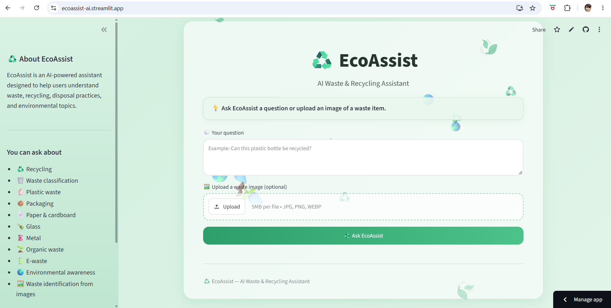

# ♻️ EcoAssist — AI Waste & Recycling Assistant

**EcoAssist** is an AI-powered waste and recycling assistant designed to help users understand waste classification, recycling, disposal practices, and environmental topics.

The application supports both **text-based questions and image-based waste analysis**, allowing users to upload an image of a waste item and ask EcoAssist what it appears to be and how it should be handled.

🌐 **Live Demo:** https://ecoassist-ai.streamlit.app/

📂 **GitHub:** https://github.com/DeepakChaudhary369/EcoAssist

---

## 📸 Application Preview




## 🌱 Project Overview

Improper waste disposal and limited awareness about recycling practices can contribute to environmental pollution and inefficient waste management.

EcoAssist was developed as a small AI-powered digital solution that provides accessible information about:

* ♻️ Recycling
* 🗑️ Waste classification
* 🧴 Plastic waste
* 📦 Packaging
* 📄 Paper and cardboard
* 🍾 Glass
* 🥫 Metal
* 🌱 Organic waste
* 🔋 E-waste
* 🌍 Environmental awareness
* 🖼️ Waste identification from images

Users can ask questions in natural language or upload an image of a waste item for AI-assisted analysis.

---

## ✨ Key Features

### 💬 AI Waste & Recycling Assistant

Users can ask natural-language questions about waste management, recycling, disposal practices, and environmental topics.

Example:

> "How should I dispose of plastic packaging?"

EcoAssist generates an AI-based response focused on waste management and environmental guidance.

---

### 🖼️ Image-Based Waste Analysis

Users can upload an image of a waste item.

The AI analyzes the image and provides an approximate interpretation of the item and relevant disposal or recycling guidance.

Example:

> Upload a photo of a plastic bottle and ask how it should be disposed of.

The application is designed to communicate uncertainty when an image does not provide enough information for confident identification.

---

### 🌍 Environment-Focused AI

EcoAssist is intentionally focused on environmental and waste-management topics rather than functioning as a general-purpose chatbot.

The assistant can address areas such as:

* Waste classification
* Recycling practices
* Plastic waste
* Packaging
* Paper and cardboard
* Glass
* Metal
* Organic waste
* E-waste
* Environmental awareness
* Waste reduction

---

### 🔐 Secure API Key Management

The Gemini API key is **not stored in the source code or GitHub repository**.

For local development, the key is stored using environment/secrets configuration.

For Streamlit Community Cloud, the API key is stored using Streamlit Secrets.

Sensitive files are excluded through `.gitignore`.

---

### 📏 Upload Size Control

The application limits image uploads to **5 MB** through Streamlit configuration.

This helps prevent unnecessarily large uploads and keeps the application lightweight.

---

## 🛠️ Technology Stack

| Technology                | Purpose                         |
| ------------------------- | ------------------------------- |
| Python                    | Application development         |
| Streamlit                 | Web application interface       |
| Google Gemini API         | AI text and image analysis      |
| Google GenAI SDK          | Gemini API integration          |
| Pillow                    | Image processing                |
| python-dotenv             | Local environment configuration |
| Git                       | Version control                 |
| GitHub                    | Source code hosting             |
| Streamlit Community Cloud | Application deployment          |

---

## 🏗️ Project Architecture

```text
                    ┌──────────────────────┐
                    │       User           │
                    └──────────┬───────────┘
                               │
                    Text Question / Image
                               │
                               ▼
                    ┌──────────────────────┐
                    │     Streamlit UI     │
                    │       app.py         │
                    └──────────┬───────────┘
                               │
                               ▼
                    ┌──────────────────────┐
                    │    Gemini API        │
                    │  AI Text + Vision    │
                    └──────────┬───────────┘
                               │
                               ▼
                    ┌──────────────────────┐
                    │  EcoAssist Response  │
                    │                      │
                    │ Waste Information    │
                    │ Recycling Guidance   │
                    │ Disposal Guidance    │
                    └──────────────────────┘
```

---

## 📁 Project Structure

```text
EcoAssist/
│
├── .streamlit/
│   └── config.toml
│
├── backend/
│   ├── main.py
│   ├── requirements.txt
│   
│
├── frontend/
│   ├── index.html
│   ├── script.js
│   └── style.css
│
├── app.py
├── requirements.txt
├── .gitignore
└── README.md
```

### Main Components

**`app.py`**

The main Streamlit application responsible for:

* User interface
* Text input
* Image upload
* Gemini API communication
* AI response generation
* Application styling

**`backend/main.py`**

Contains the FastAPI-based backend implementation developed during the project's earlier architecture.

**`frontend/`**

Contains the earlier HTML, CSS, and JavaScript interface implementation.

**`.streamlit/config.toml`**

Contains Streamlit configuration, including the application's upload-size limit.

---

## 🚀 Running the Project Locally

### 1. Clone the repository

```bash
git clone https://github.com/DeepakChaudhary369/EcoAssist.git
```

Move into the project directory:

```bash
cd EcoAssist
```

---

### 2. Create a virtual environment

Windows:

```bash
python -m venv venv
```

Activate it:

```bash
venv\Scripts\activate
```

---

### 3. Install dependencies

```bash
pip install -r requirements.txt
```

---

### 4. Configure the Gemini API key

Create:

```text
.streamlit/secrets.toml
```

Add:

```toml
GEMINI_API_KEY = "YOUR_GEMINI_API_KEY"
```

Replace `YOUR_GEMINI_API_KEY` with your own API key.

**Never commit this file to GitHub.**

It is already excluded through `.gitignore`.

---

### 5. Run the application

From the project root:

```bash
python -m streamlit run app.py
```

The application will open in your browser.

---

## ☁️ Deployment

EcoAssist is deployed using **Streamlit Community Cloud**.

Deployment flow:

```text
GitHub Repository
        │
        ▼
Streamlit Community Cloud
        │
        ▼
       app.py
        │
        ▼
   Gemini API
        │
        ▼
   Live Application
```

### Streamlit Secrets

The Gemini API key is configured through Streamlit Cloud Secrets rather than being committed to GitHub.

Required secret:

```toml
GEMINI_API_KEY = "YOUR_GEMINI_API_KEY"
```

---

## 🧪 Example Use Cases

### Example 1 — Recycling Question

**User:**

```text
Can plastic packaging be recycled?
```

**EcoAssist:**

Provides general recycling information and disposal considerations.

---

### Example 2 — Waste Classification

**User:**

```text
What category does a used cardboard box belong to?
```

EcoAssist provides information about the likely waste category and recycling considerations.

---

### Example 3 — Image Analysis

**User:**

Uploads an image of a plastic bottle and asks:

```text
What type of waste does this appear to be and how should I dispose of it?
```

EcoAssist analyzes the image and provides an AI-assisted response.

---

## 🧠 Responsible AI Considerations

EcoAssist is designed as an informational assistant and does not replace official waste-management authorities or local recycling guidelines.

### Uncertainty

Image-based identification may not always be accurate.

The system should therefore treat visual classifications as approximate rather than guaranteed.

### Local Regulations

Recycling and disposal rules can vary by:

* City
* Region
* Country
* Waste-management provider

Users should verify specific disposal requirements with their local authorities when necessary.

### Safety

EcoAssist should not be treated as an authoritative source for handling hazardous materials.

For hazardous, medical, chemical, or other potentially dangerous waste, users should follow official guidance and appropriate safety procedures.

### API Security

API credentials are kept outside the public source code and are managed through environment variables or Streamlit Secrets.

---

## 🔒 Security

The project uses `.gitignore` to prevent sensitive configuration files from being committed.

Ignored files include:

```text
.env
*.env
.streamlit/secrets.toml
__pycache__/
```

The Gemini API key should **never** be placed directly inside `app.py` or committed to GitHub.

---

## 🎯 Project Objectives

The main objectives of EcoAssist are to:

1. Explore practical applications of Generative AI.
2. Build an accessible environmental information assistant.
3. Demonstrate multimodal AI interaction using text and images.
4. Apply AI to a real-world environmental problem.
5. Develop and deploy a user-facing digital application.
6. Practice secure API-key management.
7. Explore responsible use of AI for environmental information.

---

## 📚 What I Learned

Through this project, I worked with:

* Python application development
* Streamlit
* Generative AI APIs
* Gemini multimodal capabilities
* Image input and processing
* Prompt/system instruction design
* API integration
* Environment variables and secrets
* Git and GitHub
* Streamlit Community Cloud
* Web application deployment
* Responsible AI considerations
* User-interface design

---

## 🔮 Future Improvements

Potential future improvements include:

* 📍 Location-aware recycling guidance
* 🏙️ Local waste-management rules
* ♻️ More detailed recyclable/non-recyclable classification
* 📊 Waste-management statistics and dashboards
* 🌐 Support for multiple languages
* 🧠 Improved image classification
* 📱 Mobile-friendly improvements
* 🗃️ Optional waste-history tracking
* 🔎 Integration with verified local recycling resources
* ♻️ Personalized waste-reduction recommendations

---

## ⚠️ Limitations

EcoAssist currently provides AI-generated information and should not be considered an official waste-management authority.

Image analysis can be affected by:

* Image quality
* Lighting
* Occlusion
* Multiple objects in an image
* Similar-looking materials
* Lack of visible material information

Waste disposal recommendations may also vary depending on local regulations.

---

## 🌐 Live Demo

Try EcoAssist here:

**[https://ecoassist-ai.streamlit.app/](https://ecoassist-ai.streamlit.app/)**

---

## 👨‍💻 Author

**Deepak Chaudhary**

B.Tech Computer Science & Engineering — Data Science

GitHub:
[https://github.com/DeepakChaudhary369](https://github.com/DeepakChaudhary369)

LinkedIn:
[https://www.linkedin.com/in/deepakchaudhary369](https://www.linkedin.com/in/deepakchaudhary369)

---

## ⭐ If you find this project useful

Consider giving the repository a ⭐ on GitHub.

````

### One important change before you paste it

For the screenshot section, don't leave:

```markdown

````

unless you actually create that `screenshots` folder and upload the screenshot.

Since your app is already live, I'd recommend **adding 2–3 screenshots** to GitHub:

```text
EcoAssist/
├── screenshots/
│   ├── ecoassist-home.png
│   ├── text-response.png
│   └── image-analysis.png
```

Then the README will look much more professional.

Also, because your project is now a **working deployed AI application**, I'd put the **Live Demo near the top** of the README, exactly as above. This makes it easy for recruiters to immediately test it.
